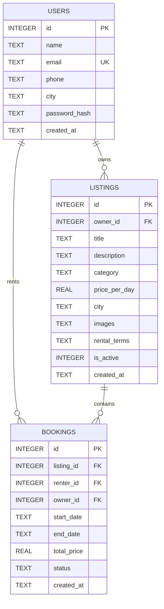

# Camera Equipment Rental Platform - Software Requirements Specification (SRS)

## 1. Introduction

### Purpose
This document specifies the software requirements for the **Rental Platform**, a web-based marketplace where owners can rent out camera equipment and renters can search and book gear for specific dates.

### Scope
- **Core Functionality:** Allows owners to list camera equipment (cameras, lenses, lights, tripods, etc.) with daily rental rates. Renters can search equipment, view availability calendars, select booking date ranges, and submit booking requests.
- **Conflict Prevention:** An availability calendar prevents double-booking for overlapping dates.
- **AI Integration:** Powered by Google Gemini AI on the backend to automatically generate plain-language rental terms and conditions for owners.
- **Out of Scope (Current Release):** Online payment gateway processing, in-app messaging/chat, user reviews & ratings, and shipping/delivery logistics.

### Definitions & Glossary
- **Owner:** A registered user who lists equipment for rent.
- **Renter:** A registered user who reserves and rents equipment. *(Note: A single user account can act as both an owner and a renter).*
- **Listing:** An item catalog entry available for rent.
- **Booking:** A reservation request for a listing covering a specific start date to an end date.
- **Availability Calendar:** An interactive calendar showing available vs. booked dates for an item.
- **Gemini AI:** Google's generative AI model, utilized to draft customized rental terms and conditions.
- **SQLite:** A lightweight, serverless relational database stored as a single local file.

---

## 2. Overall Description

### Product Perspective
The platform is a lightweight, responsive full-stack web application:
- **Frontend:** HTML5, CSS3 (vanilla CSS, responsive layouts), Vanilla JavaScript.
- **Backend:** Node.js with Express.js REST API.
- **Database:** SQLite (local single-file storage).
- **External Services:** Google Gemini API (invoked strictly from the backend to keep credentials secure).

### Product Functions
1. User registration, authentication (login/logout), and profile management.
2. Equipment listing management (create, read/browse, search, edit, delete, toggle active status).
3. Real-time availability checks and double-booking prevention.
4. Booking lifecycle management (request, accept, reject, cancel, complete).
5. AI-assisted rental terms and agreement generation.

### User Roles & Classes
- **Owner:** Lists equipment, manages listings, reviews and responds to incoming rental requests.
- **Renter:** Searches and filters listings, views calendars, and submits booking requests.
- **Admin (Optional):** Moderates content and removes fraudulent or inappropriate listings.

### Operating Environment
- **Client:** Modern web browsers (Google Chrome, Microsoft Edge, Mozilla Firefox, Safari) on both mobile devices and desktop computers.
- **Server:** Node.js runtime environment.
- **Database:** Local SQLite database file (no standalone database server required).

### Constraints
- **Tech Stack:** HTML, CSS, JavaScript, Node.js, Express, SQLite, Google Gemini API.
- **Currency & Billing:** Indian Rupees (₹), calculated on a per-day basis.
- **Payment Handling:** Offline / peer-to-peer settlement between renter and owner (no integrated payment gateway).
- **Timeline:** Rapid development and implementation cycle.

### Assumptions & Dependencies
- Users have an active internet connection.
- A valid Google Gemini API key is configured on the backend server.
- Date calculation is **inclusive**: both the start date and end date count as billable rental days.

---

## 3. Specific & Functional Requirements

### 3.1 Authentication & Profile Module
- **User Registration:** Users can sign up with full name, email address, phone number, city, and password.
- **Login & Session:** Users authenticate using email and password. Session management / token-based authentication.
- **Password Security:** Passwords must be securely hashed (e.g., bcrypt) prior to database persistence.
- **Protected Routes:** Unauthorized users cannot access booking, listing management, or profile routes.
- **Logout:** Users can securely terminate their session.
- **Profile Management (Optional):** Users can view and update their profile details.

### 3.2 Listings & Search Module
- **Add Listing:** Owners can publish listings with:
  - Title
  - Description
  - Category (e.g., Cameras, Lenses, Lighting, Tripods & Support, Audio, Accessories)
  - Price per day (₹)
  - City / Location
  - Image URLs / uploads
  - Rental terms
  - Active status
- **Owner Ownership Controls:** Owners can only edit or delete their own listings.
- **Deletion Safeguard:** Listings with active or upcoming bookings cannot be deleted.
- **Listing Status:** Owners can toggle listings between active and inactive.
- **Browse & Discovery:** Browse page displays all active listings.
- **Search & Filtering:**
  - Keyword search on title and description.
  - Filter by category, city, and price range.
- **Listing Detail Page:**
  - Comprehensive item details, photos, and daily price.
  - Rental terms and conditions.
  - Interactive availability calendar.
  - Booking request form with automatic cost calculation.
- **My Listings:** Dedicated dashboard for owners to view and manage all their listings.

### 3.3 Availability Calendar Module
- **Visual Calendar:** Calendar UI marks booked and reserved dates as disabled/unavailable.
- **Past Date Restriction:** Past dates cannot be selected for new bookings.
- **Server-Side Validation:** The backend strictly checks and rejects any booking request that overlaps with an existing confirmed/pending booking.
- **Date Blocking (Optional):** Owners can manually block out custom date ranges (e.g., maintenance or personal use).
- **Date Re-release:** When a booking is rejected or cancelled, the associated dates immediately become available for others to book.

### 3.4 Booking Management Module
- **Booking Creation:**
  - Renter picks start and end dates.
  - Platform displays total days (inclusive) and total rental price (`days * price_per_day`).
  - Renter must review and accept the rental terms before submitting.
  - Self-booking is prohibited (owners cannot book their own listings).
  - Newly submitted bookings receive a initial status of `Pending`.
- **Status Lifecycle:**
  - `Pending` $\rightarrow$ Owner accepts $\rightarrow$ `Confirmed`
  - `Pending` $\rightarrow$ Owner rejects $\rightarrow$ `Rejected`
  - `Pending` / `Confirmed` $\rightarrow$ Renter cancels (prior to start date) $\rightarrow$ `Cancelled`
  - `Confirmed` $\rightarrow$ After end date $\rightarrow$ `Completed`
- **Dashboards:**
  - **My Bookings:** Renters can track their submitted requests, statuses, and cancel eligible bookings.
  - **Booking Requests:** Owners can review incoming booking requests to accept or reject them.

### 3.5 AI Rental Terms Generation Module
- **Interactive Generation:** "Generate Rental Terms" action available when creating or editing a listing.
- **AI Prompt Coverage:** Prompts Google Gemini to produce straightforward, customized clauses covering:
  - Permitted use and care instructions
  - Return timing and procedures
  - Damage and loss liabilities
  - Late return fees
  - Cancellation policy
- **Owner Customization:** Generated terms are loaded into an editable text field so the owner can review, edit, or adjust before saving.
- **Security:** Gemini API key is securely stored on the server environment (`.env`) and never exposed to client browsers.
- **Graceful Fallback:** If the Gemini API request fails or is unreachable, the system automatically populates a standard default terms template.
- **Legal Disclaimer:** Clearly notifies users that generated terms are AI-assisted guidelines and do not constitute formal legal advice.

---

## 4. External Interface Requirements

### User Interface (UI)
The web application includes the following responsive views (supporting both mobile and desktop screen sizes):
1. **Register** (`/register`)
2. **Login** (`/login`)
3. **Browse / Home** (`/` or `/browse`)
4. **Listing Detail** (`/listings/:id`)
5. **Add / Edit Listing** (`/listings/new`, `/listings/:id/edit`)
6. **My Listings** (`/my-listings`)
7. **My Bookings** (`/my-bookings`)
8. **Booking Requests** (`/booking-requests`)
9. **User Profile** (`/profile`)

### Software Interfaces
- **Database:** SQLite database accessed via Node.js driver (e.g. `sqlite3` or `better-sqlite3`).
- **AI Integration:** Google Gemini API (`@google/genai` or `@google/generative-ai` / REST endpoints).

---

## 5. Non-Functional Requirements

- **Performance:** Fast response time; pages and key queries should load within ~3 seconds.
- **Security:**
  - Passwords hashed using standard cryptographic algorithms (e.g., bcrypt).
  - Authenticated session tokens.
  - Sensitive API keys, secrets, and environment configurations stored strictly in `.env`.
- **Usability:** Clean, intuitive UI optimized for both desktop and mobile viewports.
- **Reliability & Concurrency:**
  - Guaranteed double-booking prevention under concurrent requests.
  - System resilience: Core rental and booking functionality remains 100% operational even if the external Gemini AI service is unavailable.

---

## 6. Database Design

### Table Definitions

#### `users`
| Column | Type | Constraints | Description |
|---|---|---|---|
| `id` | INTEGER | PRIMARY KEY AUTOINCREMENT | Unique user identifier |
| `name` | TEXT | NOT NULL | User's full name |
| `email` | TEXT | UNIQUE NOT NULL | User's login email address |
| `phone` | TEXT | NOT NULL | Contact telephone number |
| `city` | TEXT | NOT NULL | User's primary location/city |
| `password` | TEXT | NOT NULL | Securely hashed password |
| `created_at` | DATETIME | DEFAULT CURRENT_TIMESTAMP | Registration timestamp |

#### `listings`
| Column | Type | Constraints | Description |
|---|---|---|---|
| `id` | INTEGER | PRIMARY KEY AUTOINCREMENT | Unique listing identifier |
| `owner_id` | INTEGER | FOREIGN KEY (users.id) NOT NULL | ID of the equipment owner |
| `title` | TEXT | NOT NULL | Listing title/headline |
| `description` | TEXT | NOT NULL | Detailed item description |
| `category` | TEXT | NOT NULL | Equipment category (Camera, Lens, etc.) |
| `price_per_day`| REAL | NOT NULL | Rental price per day in ₹ |
| `city` | TEXT | NOT NULL | Location where gear is available |
| `images` | TEXT | | Image path(s) or URLs (JSON/comma-separated) |
| `rental_terms` | TEXT | | AI-generated or custom rental terms |
| `is_active` | INTEGER | DEFAULT 1 | Active listing flag (1 = Active, 0 = Inactive) |
| `created_at` | DATETIME | DEFAULT CURRENT_TIMESTAMP | Listing creation timestamp |

#### `bookings`
| Column | Type | Constraints | Description |
|---|---|---|---|
| `id` | INTEGER | PRIMARY KEY AUTOINCREMENT | Unique booking identifier |
| `listing_id` | INTEGER | FOREIGN KEY (listings.id) NOT NULL | Reserved equipment ID |
| `renter_id` | INTEGER | FOREIGN KEY (users.id) NOT NULL | ID of the renting user |
| `owner_id` | INTEGER | FOREIGN KEY (users.id) NOT NULL | ID of the equipment owner |
| `start_date` | TEXT | NOT NULL | Rental start date (YYYY-MM-DD) |
| `end_date` | TEXT | NOT NULL | Rental end date (YYYY-MM-DD) |
| `total_price` | REAL | NOT NULL | Calculated price (`days * price_per_day`) |
| `status` | TEXT | NOT NULL DEFAULT 'Pending' | `Pending`, `Confirmed`, `Rejected`, `Cancelled`, `Completed` |
| `created_at` | DATETIME | DEFAULT CURRENT_TIMESTAMP | Booking submission timestamp |

---

## 7. Future Scope
- **Online Payments:** Integrated payment gateway (Razorpay/Stripe) for direct card/UPI transactions and security deposit holds.
- **In-App Messaging:** Real-time chat between owner and renter for pickup coordination.
- **Reviews & Ratings:** Mutual feedback, reputation scoring, and verified equipment reviews.
- **Automated Notifications:** SMS and email alerts for booking requests, status changes, and return reminders.
- **Expanded Inventory:** Support for additional categories such as cinema rigs, studio spaces, drone kits, costumes, and sporting equipment.
